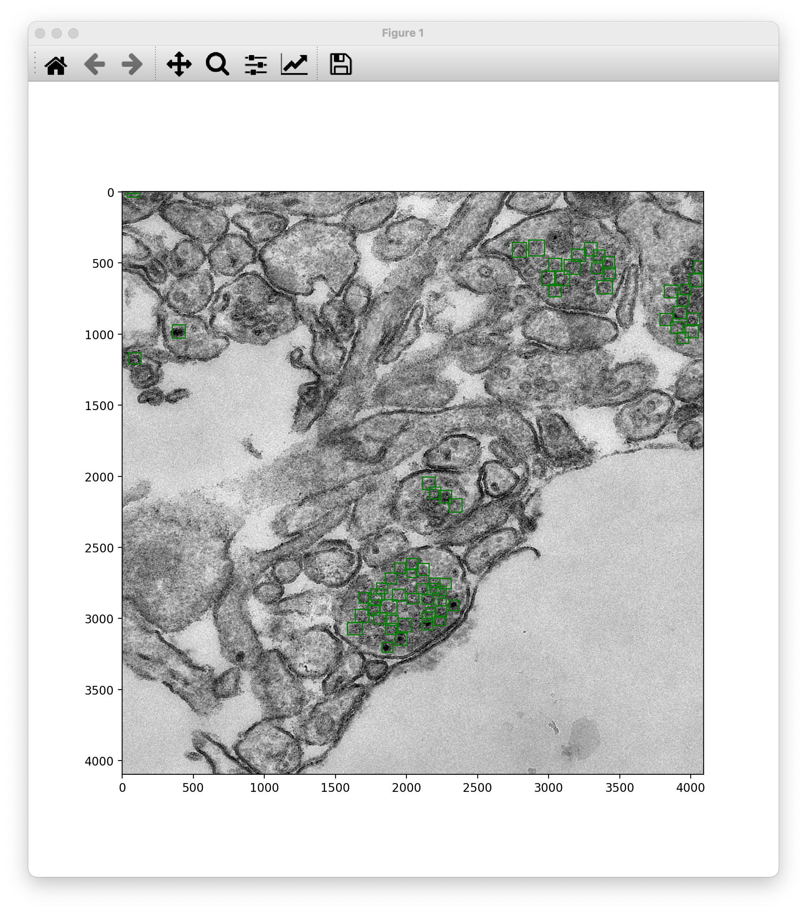
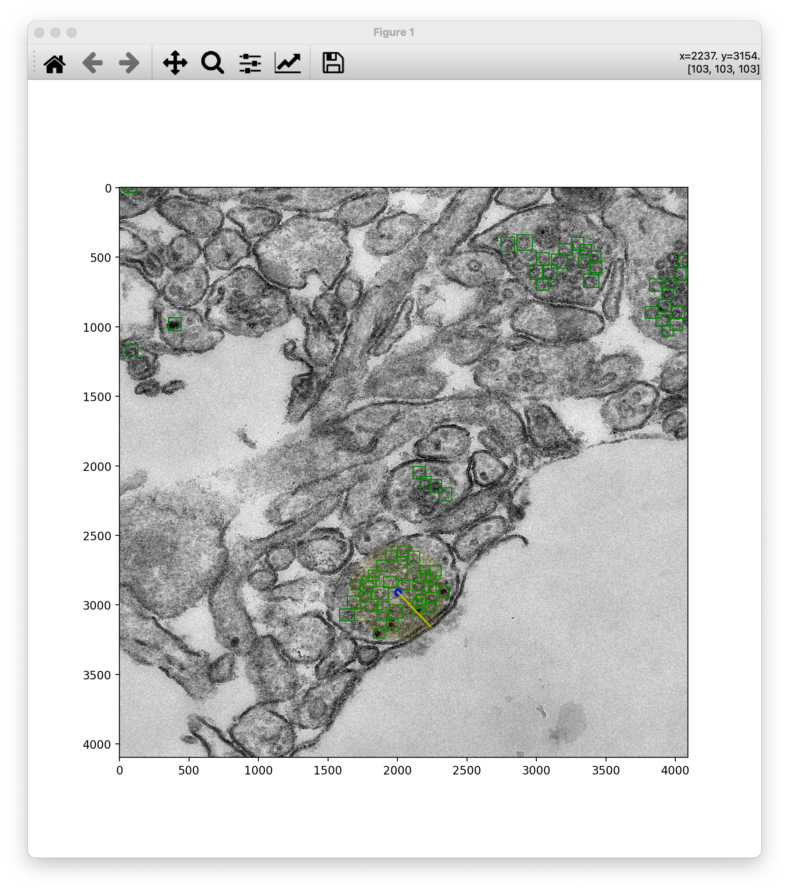

# Vescicle ML Detection
## Introduction
In this project, I developed and trained a Region-based Convolutional Neural Network (RCNN) to identify dyed brain vesicles in electron microscope images captured at varying magnification levels. The objective was to demonstrate a proof of concept, exploring the adaptability of an RCNN—traditionally used for tasks like distinguishing between cats and dogs—to automate the detection of vesicles with high accuracy. Although the project is not intended as a fully operational solution, it successfully showcases the potential of leveraging RCNN architectures to address complex biomedical imaging challenges. 

Due to the sensitive nature of the images, only the pre-trained models have been pushed to this gitspace without the full set of training images, but only a small number of them are provided for testing. The untrained models can be found in the `models` folder, which is a submodule to the Tensorflow Model garden.

I is iportant to note that this task only require **~80% identification efficiency** as the nature of the images makes perfect identification near impossible even for humans. 

The code below should be able to identify the vescicles of interest in the image, draw boxes around them, and allow users to perform post processing analysis as well as generate some summary plots. 
Here some examples of the expected images out of the tool.




<!--  -->
<!--  -->
<!--  -->

## Code Breakdown
- input
- output
- models
- data
- trained_models
- utils
## How to run
### Setup
Firstly, the correct python environment needs to be setup in order to run the scripts.

```bash
conda env create env_setup.yml --name vesc
```
then the trained models protos need to be added to the python path so that they can be used in code. 
To do so just run the setup.sh script from terminal:

```bash
source setup.sh
```

if you need to setup the conda environment then run

```bash
source setup.sh conda create 
```

if the conda environment is already setup then just run it to activate

```bash
source setup.sh conda activate
```

### How to run
The code can be run by running the individual source scripts or by using the runme file. I suggest using the runme script as it will ensure the scripts are ran as they are supposed to. 
There are three main steps in the pipeline:
1. run the ML box finder [finder]
2. perform post processing using the drawing application [draw]
3. run the analysis script [analysis]

All above steps can be run using the appropriate command with the runme:

```bash
source runme.sh --run finder
```
```bash
source runme.sh --run draw
```
```bash
source runme.sh --run analysis 
```
